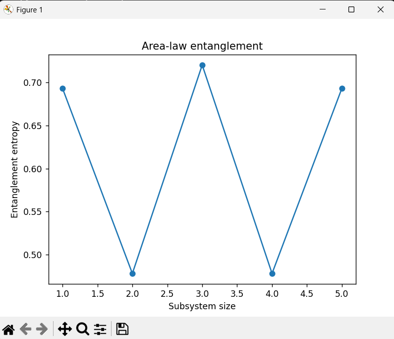
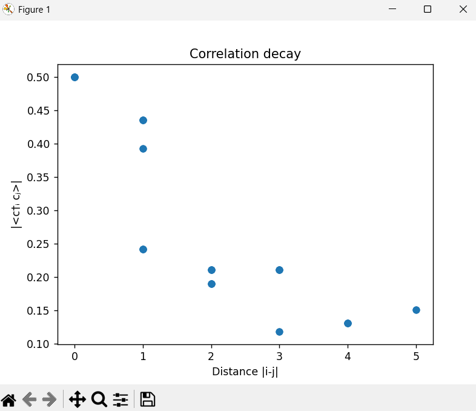

# Tensor-Network Motivated Quantum Simulation of Tight-Binding Hamiltonians

## Overview
This repository presents a hybrid classical–quantum workflow for simulating many-body lattice Hamiltonians using tensor-network intuition and quantum algorithms. The project combines exact diagonalization (QuTiP) with variational quantum eigensolvers (Qiskit) to analyze ground-state properties of a 1D tight-binding fermionic chain.

The pipeline integrates:
Physics → Entanglement Structure → Tensor Compression → Quantum Simulation

---

## Objectives
- Construct tight-binding Hamiltonians
- Compute exact ground states using QuTiP
- Analyze entanglement entropy (area law behavior)
- Study correlation decay and locality
- Map fermionic operators to qubits (Jordan–Wigner)
- Implement VQE for ground-state estimation
- Benchmark quantum results against exact solutions

---

## Physics Model

The 1D tight-binding Hamiltonian:

\[
H = -t \sum_i (c_i^\dagger c_{i+1} + \text{h.c.})
\]

This system:
- exhibits short-range correlations
- obeys area-law entanglement
- admits efficient tensor-network representations (MPS/MPO)

---

## Methods

### Classical Simulation (QuTiP)
- Exact diagonalization
- Ground-state energy computation
- Reduced density matrices
- Von Neumann entropy
- Correlation functions

### Quantum Simulation (Qiskit)
- Jordan–Wigner fermion-to-qubit mapping
- Pauli Hamiltonian construction
- Variational Quantum Eigensolver (VQE)
- Circuit depth convergence studies

---

## Results

### Entanglement entropy


### Correlation decay


### VQE convergence


Increasing circuit depth systematically improves energy estimates toward the exact solution.

---

## Installation

## Exact Diagonalization and Entanglement Analysis (QuTiP)

```python
import numpy as np
import matplotlib.pyplot as plt
from qutip import *

N = 6
t = 1.0

def destroy_i(i):
    ops = []
    for j in range(N):
        if j == i:
            ops.append(destroy(2))
        else:
            ops.append(qeye(2))
    return tensor(ops)

H = 0
for i in range(N-1):
    c_i = destroy_i(i)
    c_j = destroy_i(i+1)
    H += -t * (c_i.dag()*c_j + c_j.dag()*c_i)

energies, states = H.eigenstates()
print("Ground state energy:", energies[0])

psi0 = states[0]

entropies = []
for cut in range(1, N):
    rho = psi0.ptrace(list(range(cut)))
    entropies.append(entropy_vn(rho))

plt.plot(range(1, N), entropies, marker='o')
plt.xlabel("Subsystem size")
plt.ylabel("Entanglement entropy")
plt.title("Area-law entanglement")
plt.show()
```


